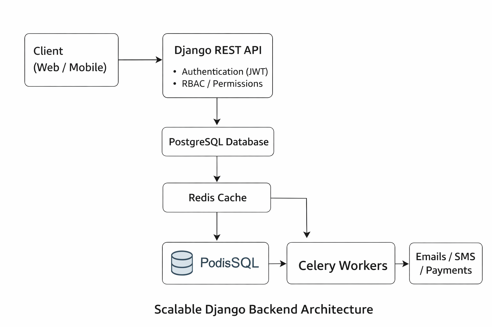

# Scalable Django REST Backend Architecture

This repository demonstrates how I design and structure scalable, secure, and production-grade backend systems using Django and Django REST Framework, following architecture patterns commonly used in high-traffic, enterprise, and product-based platforms.

## 🧠 Architecture Overview
This system is designed with a strong focus on separation of concerns, scalability, and reliability.

Key architectural principles:
- Modular Django app structure for maintainability
- RESTful API design using Django REST Framework
- Secure authentication and role-based access control (RBAC)
- Asynchronous task processing for non-blocking workflows
- Production-ready deployment patterns

## 🧩 System Architecture

This diagram represents a production-ready Django backend architecture designed to handle real-world workloads.

The system consists of:
- Stateless REST APIs
- A relational data store as the system of record
- Redis-based caching and message brokering
- Asynchronous background workers
- External service integrations (email, SMS, payments)

This architecture is commonly used in enterprise systems, fintech platforms, healthcare applications, and SaaS products.

## 🏗️ Key Components
- Django + Django REST Framework
  Core API layer handling request validation, authentication, authorization, and business logic.
- PostgreSQL
  Primary relational database ensuring data consistency and transactional integrity.
- Redis (Cache)
  Used to cache frequently accessed data and reduce database load.
- Redis + Celery
  Asynchronous task queue for background processing such as notifications, payments, and long-running jobs.
- JWT-based authentication
  Stateless authentication suitable for web and mobile clients.
- Dockerized services
  Containerized setup enabling consistent local development and scalable production deployments.
- CI/CD-ready structure
  Designed for automated testing, builds, and deployments.

## 🔐 Security
Security is implemented at multiple layers:
- Role-Based Access Control (RBAC)
- Permission-driven API endpoints
- JWT-based authentication and authorization
- Input validation and serializer-level protection
- Rate limiting and secure configuration practices

This ensures the system is robust against unauthorized access and common attack vectors.

## ⚡ Performance & Scalability
The architecture is optimized for performance and growth:
- Optimized ORM queries and indexing strategies
- Redis caching to minimize database reads
- Background task processing using Celery
- Stateless API design enabling horizontal scaling
- Independent scaling of API servers and worker processes

## ☁️ Deployment
The system is designed to be cloud-ready and environment-agnostic:
- Docker-based local and production setup
- Environment-based configuration management
- Compatible with AWS services (EC2, RDS, ElastiCache, ECS/EKS)
- Easily extendable to Kubernetes-based deployments

## 🎯 Purpose
This project reflects real-world backend architecture patterns I have implemented in:
- Healthcare management platforms
- Insurance and CRM systems
- Payment-integrated enterprise applications
- High-traffic REST API services

It showcases how to design Django systems that are scalable, secure, maintainable, and production-ready.

---

## Author:
Bheem Nishaad
Senior Backend Engineer | Python, Django, REST APIs

